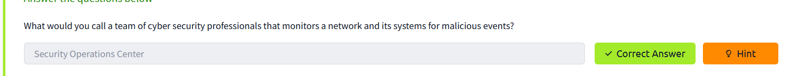
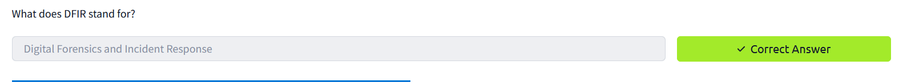
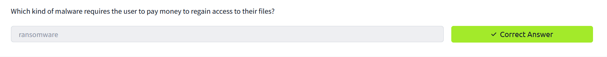
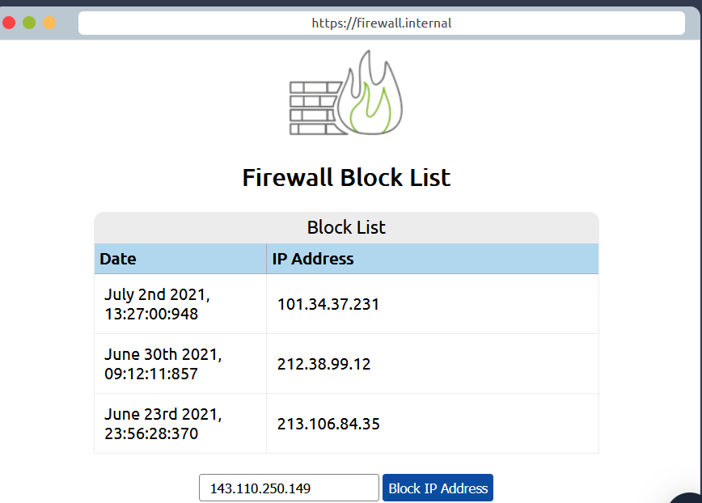

# Defensive security is somewhat the opposite of offensive security, as it is concerned with two main tasks:

    - Preventing intrusions from occurring
    - Detecting intrusions when they occur and responding properly

# Introduction to Defensive Security 
- User cyber security awareness:

- Documenting and managing assets:

- Updating and patching systems: 

- Setting up preventative security devices:

- Setting up logging and monitoring devices:

**Question 1:**  Which team focuses on defensive security?

**Answer: *blue team***

# Task 2: Areas of Defensive Security

In this task, we will cover two main topics related to defensive security:

    Security Operations Center (SOC), where we cover Threat Intelligence
    Digital Forensics and Incident Response (DFIR), where we also cover Malware Analysis

**Question 1:** What would you call a team of cyber security professionals that monitors a network and its systems for malicious events?

**Answer: *Security Operations Center***

**Question 2:** What does DFIR stand for?

**Answer: *Digital Forensics and Incident Response***

**Question 3:** Which kind of malware requires the user to pay money to regain access to their files?

**Answer: *Ransomware***

# Task 3: Practical Example of Defensive Security

To finish this room you need to follow the instruction. In the last instruction just type the first IP that unauthorized.

**Question 1:** What is the flag that you obtained by following along?

**Answer:*THM{THREAT-BLOCKED}***