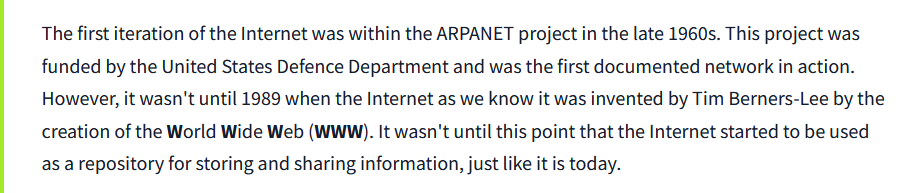
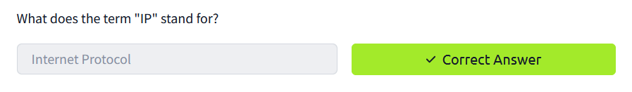
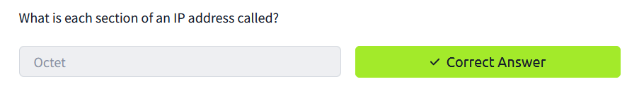
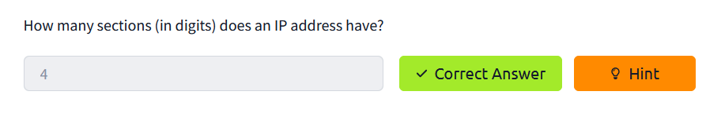
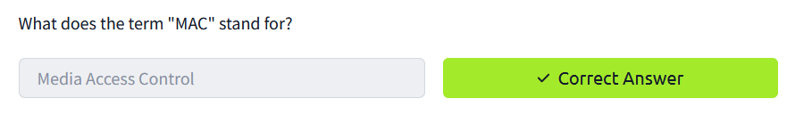
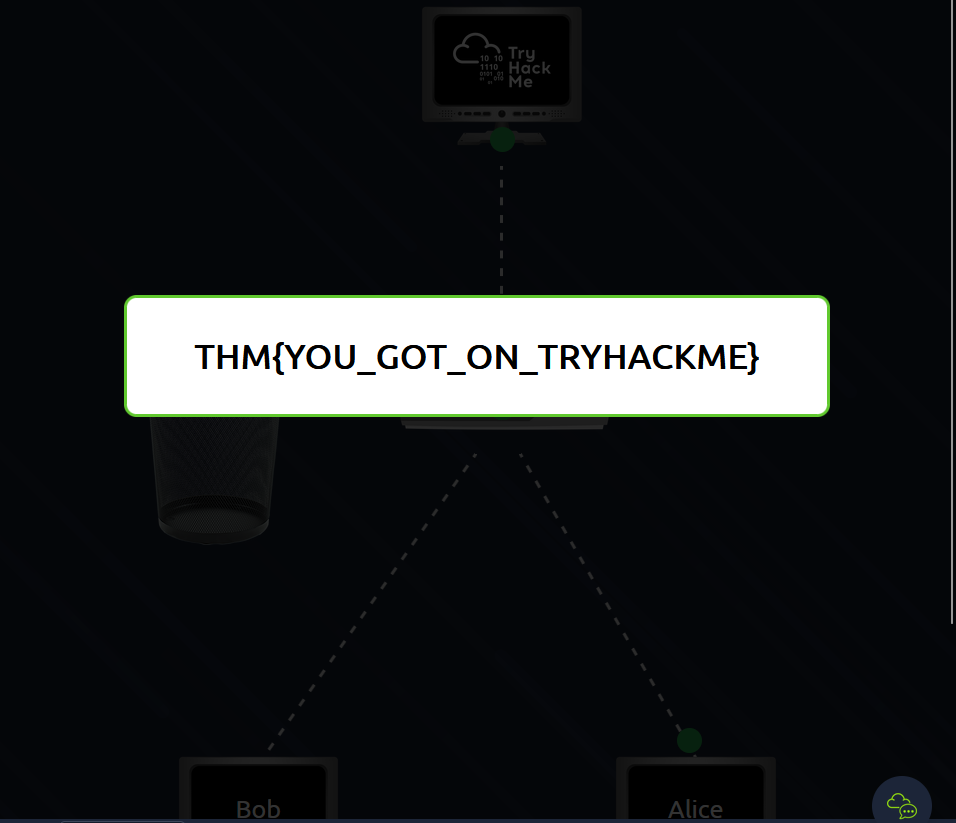
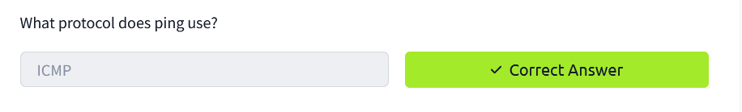
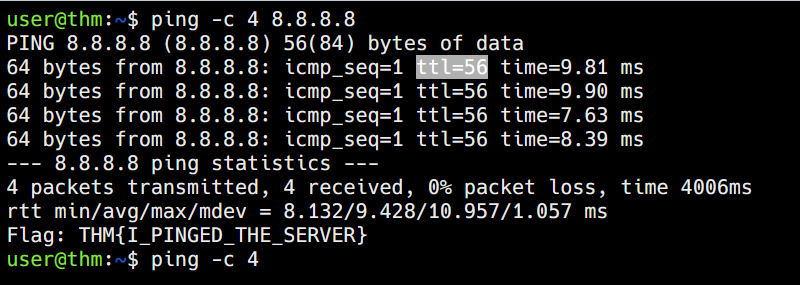

# Task 1: What is Networking? 

**Question 1:** What is the key term for devices that are connected together?

**Answer: Network**

# Task 2: What is the Internet? 

**Question 1:** Who invented the World Wide Web?

**Answer: Tim Berners-Lee**

# Task 3: Identifying Devices on a Network

**Question 1:** What does the term "IP" stand for?

**Answer: Internet Protocol**

**Question 2:** What is each section of an IP address called?

**Answer: Octet**

**Question 3:** How many sections (in digits) does an IP address have? 

**Answer: 4** 

**Question 4:** What does the term "MAC" stand for?

**Answer: Media Access Control**

**Question 5:** Deploy the interactive lab using the "View Site" button and spoof your MAC address to access the site.  What is the flag?

**Answer: THM{YOU_GOT_ON_TRYHACKME}**

# Task 4: Ping(ICMP- Internet Control Message Protocol)

**Question 1:** What protocol does ping use?

**Answer: ICMP**

**Question 2:** What is the syntax to ping 10.10.10.10?

**Answer: ping 10.10.10.10**

**Question 3:** What flag do you get when you ping 8.8.8.8?

**Answer: THM{I_PINGED_THE_SERVER}**

# Task 5 : Continue Your Learning : Intro to LAN 

**Answer: No Answer Needed** 