# Python Basics Room

This is a Walkthrough For the Python Basics. Also first day using github. 

Link Room: https://tryhackme.com/r/room/pythonbasics


# **Task 1: Introduction to Python** 


**Question 1:** Run what's currently in the code editor by clicking the green "Run Code" button (on the right-hand side of your screen), and move onto the next task.

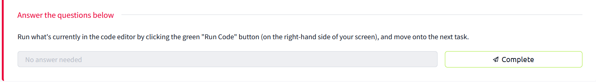 

**Answer:** No answer needed.

# **Task 2: Hello World** 

**Question 1:** On the code editor, print "Hello World". What is the flag?
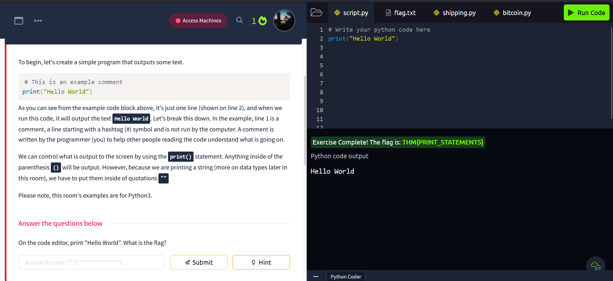

**Answer:** THM{PRINT_STATEMENTS} 

# **Task 3: Mathematical Operators** 

Things you need to know before get into the **If else and loop**
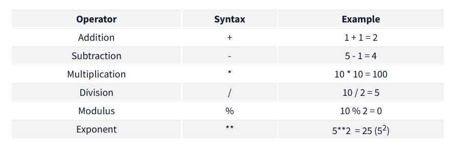

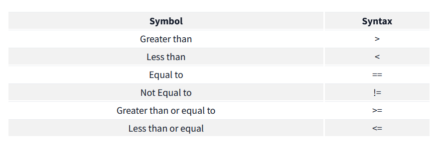


**Question 1:** In the code editor, print the result of 21 + 43. What is the flag?

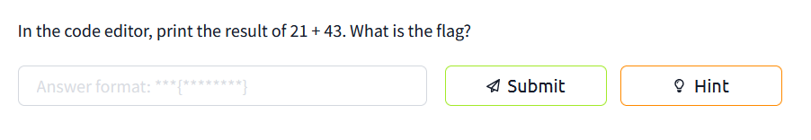

**Answer: THM{ADDITI0N}**

**Question 2:** Print the result of 142 - 52. What is the flag?

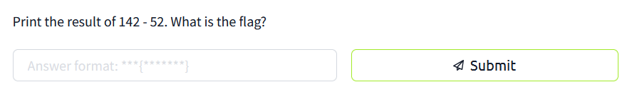

**Answer: THM{SUBTRCT}**

**Question 3:** Print the result of 10 * 342. What is the flag?

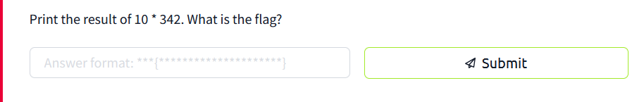

**Answer: THM{MULTIPLICATION_PYTHON}**

**Question 4:** Print the result of 5 squared. What is the flag?

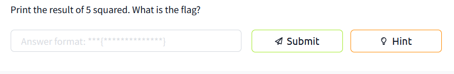

**Answer: THM{EXP0N3NT_POWER}**

# **Task 4: Variables and Data Types**

**Question 1:** In the code editor, create a variable called height and set its initial value to 200.

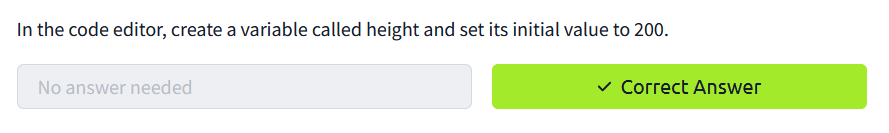

**Question 2:** On a new line, add 50 to the height variable.

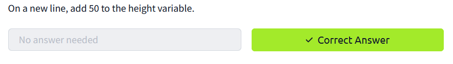

**Question 3:** On another new line, print out the value of height. What is the flag that appears?

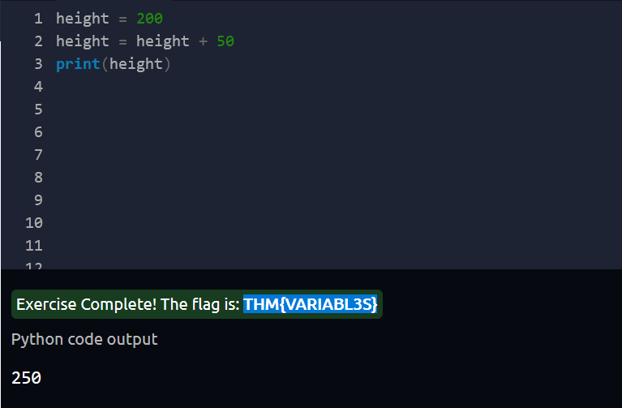

You just need to follow the instruction and *WALLA*  we have the flag.

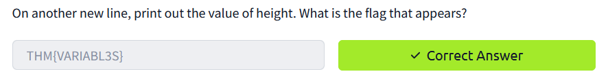

**Answer: THM{VARIABL3S}**

# **Task 5: Logical and Boolean Operators**

**Question 1:** Read the above section.

# **Task 6:  Introduction to If Statements**

**Question 1:** No Need Answer

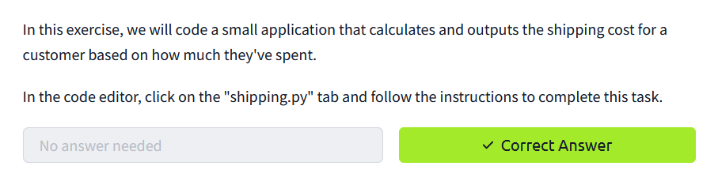

**Question 2:** Once you've written the application in the code editor's shipping.py tab, a flag will appear, which is the answer to this question.

- Just give a thought first. Then coding for a few minutes and run it on the **shipping.py**. If you don't get the flag then use the hints (This is unstimulated) but try to understand after review the code.


Run the code and get the flag. 

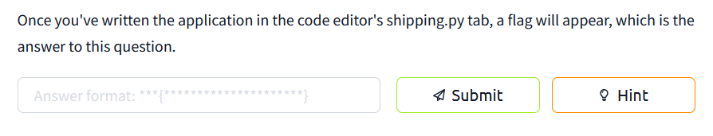

**Answer: THM{IF_STATEMENT_SHOPPING}**

**Question 3:** In shipping.py, on line 12 (when using the Code Editor's Hint), change the customer_basket_cost variable to 101 and re-run your code. You will get a flag (if the total cost is correct based on your code); the flag is the answer to this question.

To get this flag you need to change the **customer_basket_cost** to 101 (so that it will be *True* in the first condition - customer pay over $100 ) and get the second flag.

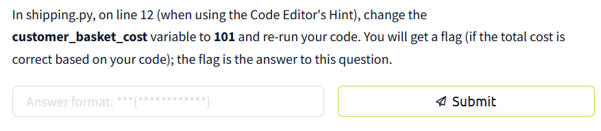

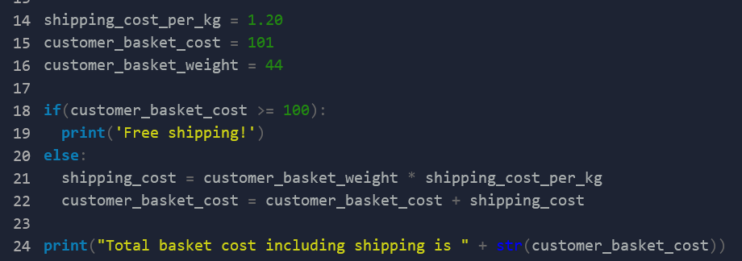

**Answer: THM{MY_FIRST_APP}**

# **Task 7: Loops**

**Question 1:** On the code editor, click back on the "script.py" tab and code a loop that outputs every number from 0 to 50.

Here's the code I use. Why range got *51* in there? It's easy to say that if you don't set the data for *i = 1* like the *while* than i will be count as 0 because 0 is often the starting number in programing.

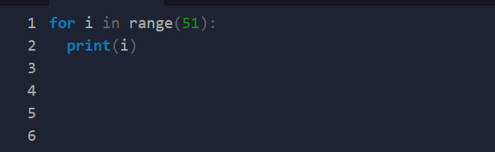

**Answer: THM{L00PS_WHILE_FOR}** 

# **Task 8: Introduction to Functions**

Everything already got explain in this room so I'll solved the question instead giving you the infor of the *def*. 

**Question 1:** Once you've written the bitcoinToUSD function, use it to calculate the value of your Bitcoin in USD, and then create an if statement to determine if the value falls below $30,000; if it does, output a message to alert you (via a print statement).

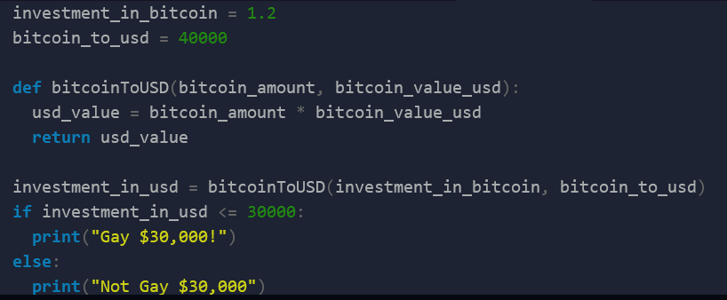

After you write this code and run it *by yourself* you will get the flag.

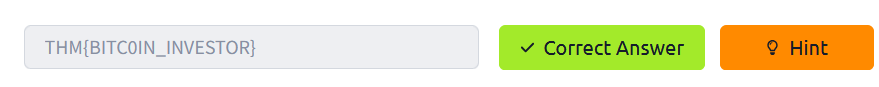

**Answer: THM{BITC0IN_INVESTOR}** 

**Question 2:** 1 Bitcoin is now worth $24,000. In the code editor on line 14, update the bitcoin_to_usd variable value to 24000 and see if your Python program recognises that your investment is below the $30,000 threshold.

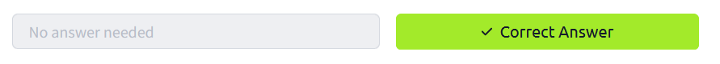

**Answer: No Answer Needed**

# **Task 9: Files** 

3 things you need to remember if you want to know how to get interact with the text file that's : 
- Read
- Write 
- Close (Only use at the end in the write command)

**Question 1:** In the code editor, write Python code to read the flag.txt file. What is the flag in this file?

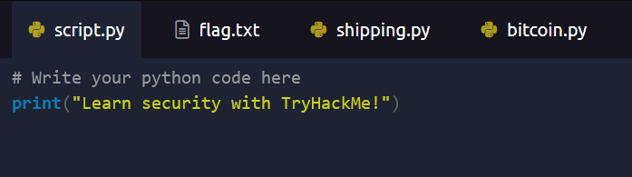

To read the *flag.txt* file you need to know how to read file with script
(thing already explain on this room). Give a try.

**This is the code I use to read it.**

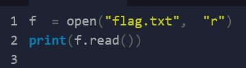

**Answer: THM{F1LE_R3AD}** 

# **Task 10: Imports**

```Import datetime
flag = datetime.datetime.now()
print(flag)
```

This is how you use it: 

*Calling libaryname.methodname()* 

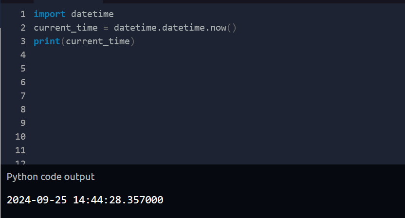

**Question 1:**  Read the task and run the Python example code above in the code editor on the right.

**Answer: No Answer Needed**


# *This is the easy room for beginner want to know more about python. Pls give a like for my writeup (T_T)*