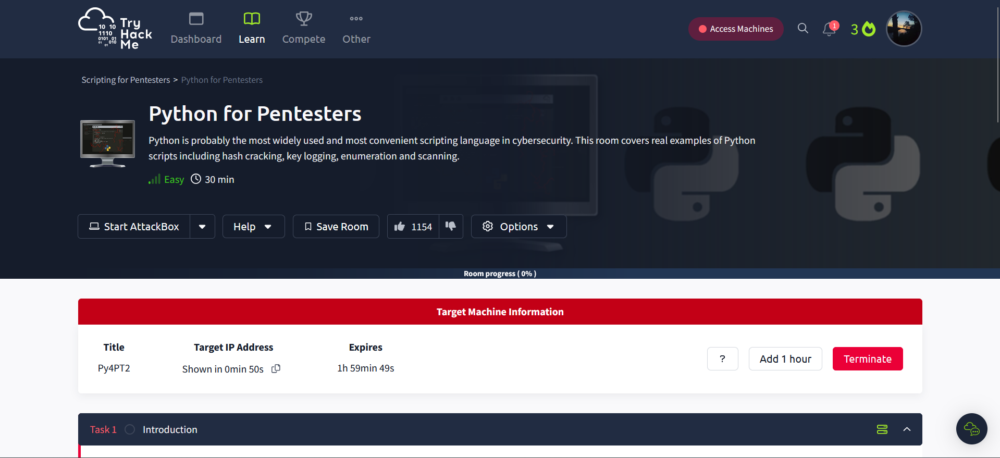

# **Task 1: Introduction**

 

# **Task 2: Subdomain Enumeration** 

This Task will show you how the dns work. 

**Question 1:** What other protocol could be used for subdomain enumeration?

**Answer: *DNS***

**Question 2:** What function does Python use to get the input from the command line?

**Answer: *sys.argv***

# **Task 3: Directory Enumeration**

**Question  1:** 
